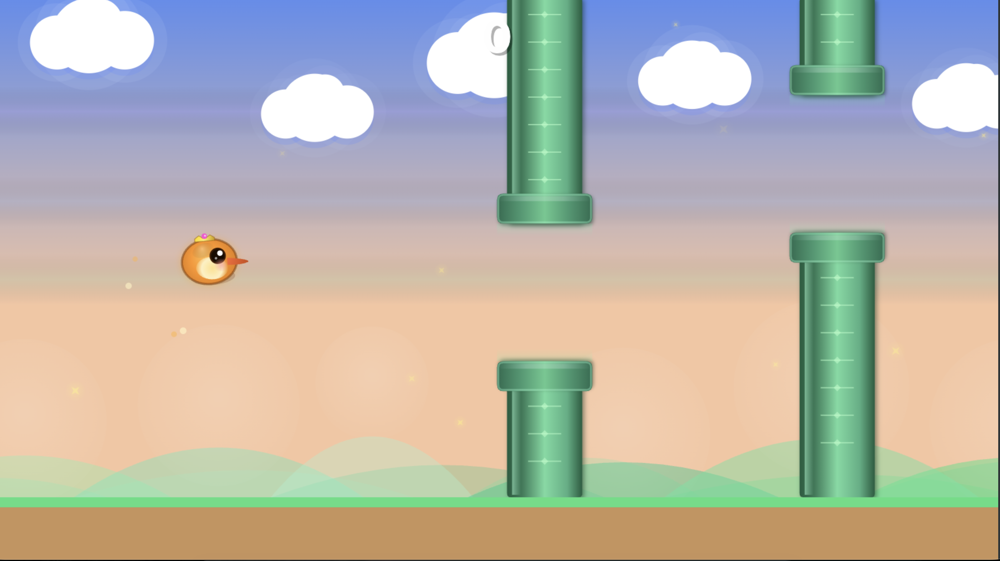

# 🐦 Flappy Bird

A polished, festive Flappy Bird game built as a single-page application with HTML5 Canvas and TypeScript, styled like a chubby bird soaring through a premium magical kingdom.



## ✨ Features

- **Story Mode** — 20 levels with increasing difficulty, 30 seconds each, and a shared 3-2-1 run start
- **Infinite Mode** — Endless gameplay with 4 difficulty levels (Easy, Medium, Hard, Impossible)
- **Power-ups** (Infinite Mode) — Multiplier, shield, slow motion, and shrink rewards with pre-run explanations
- **Bee Skin** — Switch between the default bird and a bee variant directly from the start screen; the selection persists between sessions
- **Premium Storybook Art** — Hand-authored SVG birds, rewards, pipes, and world layers composited in Canvas for a richer top-app-store look
- **Unified Scene Chrome** — Shared glass panels, premium buttons, richer overlays, and stronger typography across menus, HUD, pause, game over, and level complete flows
- **Procedural Audio** — All sound effects and background music synthesized via Web Audio API
- **Responsive** — Scales to the browser's visible area while maintaining aspect ratio
- **Touch Support** — Tap to flap on mobile devices
- **High Scores** — Persisted locally via localStorage
- **Zero Dependencies** — No runtime dependencies, pure TypeScript + Canvas

## 🎮 Controls

| Action | Desktop | Mobile |
| ------ | ------- | ------ |
| Navigate menus | `Arrow keys` / `Tab` | — |
| Select highlighted option | `Space` / `Enter` / Click | Tap |
| Start a run | `Space` / `Enter` / Click → 3-2-1 countdown | Tap → 3-2-1 countdown |
| Change skin on start screen | `S` / Click skin switch | Tap skin switch |
| Flap during gameplay | `Space` | Tap |
| Pause | `Escape` / `P` | — |

## 🎁 Infinite Rewards

- **Multiplier** — Gives a temporary `2x` or `3x` score boost.
- **Shield** — Blocks the next pipe collision.
- **Slowmo** — Slows the whole run to half speed for a short window.
- **Shrink** — Shrinks the bird visually and reduces its hitbox for tighter gaps.

## 🚀 Getting Started

### Prerequisites

- [Node.js](https://nodejs.org/) `^20.19.0 || >=22.12.0`

### Install & Run

```bash
npm install
npm run dev
```

Open [http://localhost:5173](http://localhost:5173) in your browser.

### Build for Production

```bash
npm run build
npm run preview
```

### Continuous Integration

GitHub Actions runs `npm ci` and `npm run build` on every push and pull request through `.github/workflows/ci.yml`.

### Deploy to GitHub Pages

Push to `main` and the included GitHub Actions workflow will build and deploy automatically.

Or deploy manually:

```bash
npm run build
# Upload the `dist/` folder to any static hosting
```

## 🏗️ Architecture

```text
src/
├── engine/          # Game loop, input, physics, renderer, orchestrator
├── graphics/        # Shared theme, UI kit, loading splash, and art asset preload
├── assets/art/      # Shipped SVG art for birds, rewards, pipes, and world layers
├── entities/        # Bird, pipes, background, particles, rewards
├── scenes/          # Menu, gameplay, game over, level complete, pause
├── modes/           # Difficulty configs for story (20 levels) and infinite
├── audio/           # Web Audio API procedural sound manager
├── storage/         # localStorage high-score persistence
├── ui/              # In-game HUD (score, timer, power-ups)
└── utils/           # Constants, colors, math helpers, types
```

The app preloads the compact SVG art pack before `game.start()` so gameplay still begins from a static bundle with no network round-trips after boot.

Additional project documentation lives in `docs/`:

- `docs/design.md` — gameplay, technical architecture, rendering, audio, and scaling design
- `docs/decisions.md` — key product and engineering decisions with rationale

## 📋 Tech Stack

- **TypeScript** — Strict mode, zero `any`
- **Vite** — Lightning-fast dev server and build
- **Tailwind CSS v4** — UI overlay styling
- **HTML5 Canvas + SVG Art Pipeline** — 60fps canvas rendering with preloaded shipped art
- **Web Audio API** — Procedural sound synthesis

## 📄 License

MIT
